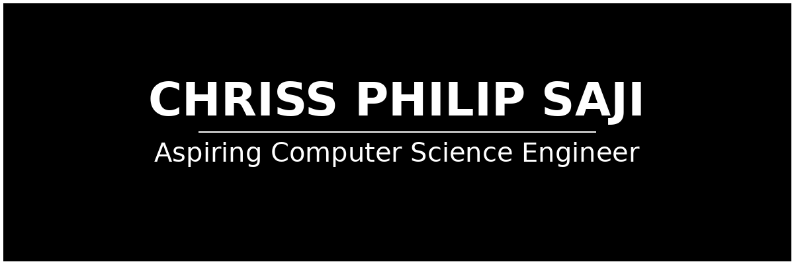

# Hi, I'm  CHRISS PHILIP SAJI👋🏾🧑🏽‍💻

I'm an aspiring junior software engineer with a background in C, SQL, Git, Python, machine learning, Java, and LLMs. I am passionate about expanding my skill set by learning ML and AI techniques. Currently, I am pursuing an honored bachelor's degree in Computer Science. Throughout my journey, I have demonstrated excellent problem-solving abilities and a keen attention to detail. I thrive in team environments and am passionate about staying up-to-date with the latest technologies.

### Find me around the web 🌐:
- Connect with me on [LinkedIn](https://www.linkedin.com/in/chriss-philip-saji/)
- Connect with me on [Gmail]: (chrissattasseril16@gmail.com)
- connect with me on [Twitter]: (https://x.com/ChrissSaji)

### Technical Skills:
- **Languages:** Java, Python, C, HTML, CSS, SQL
- **Technologies:** Git, Streamlit, Machine Learning,Generative AI, NLP.

### Experience:
- **Intern at Stem Robotics Int.**(2023): Gained hands-on experience in robotics, learned about Arduino programming and other basics of robotics.

### Some interesting Projects:
- **OpenAI-based Data App**: Built using Python and Django.
- **ML Models**: Developed regression and SVM-based models.
- **Recommender System**: Created using Similarity Search.
- **NLP Based Application**: Developed using Streamlit and ChromaDB.

### Co-curricular Achievements:
- **2024**: Published a review paper titled "Transformers : The Beginning of an Ease".
- **2023**: Published a review paper in IJERT titled "Quantum Computing".
- **2023**: Engaged in Yuva Sangam Phase 2, traveled to UP with IIT PALAKKAD cohort.
- **2023**: Participated in a blockchain-based hackathon at the college level.
- **2023**: Won Preliminary rounds in YIP 5.0, and now participating in the final rounds.
- **2023**: Participated in SIH 2023.

<!---
Yampss/Yampss is a ✨ special ✨ repository because its `README.md` (this file) appears on your GitHub profile.
You can click the Preview link to take a look at your changes.
--->
